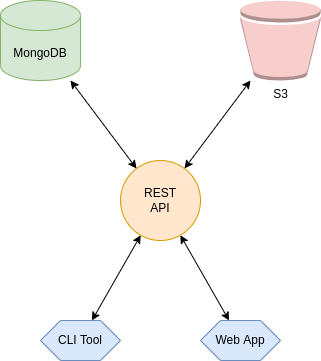
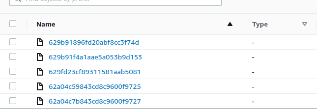
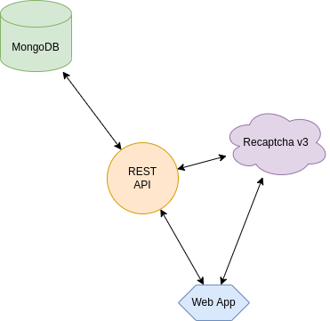
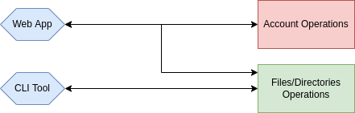
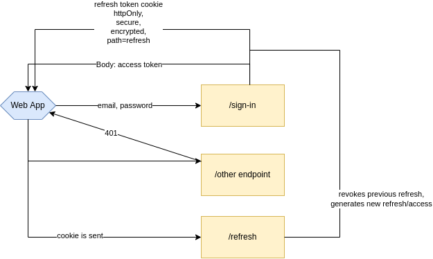
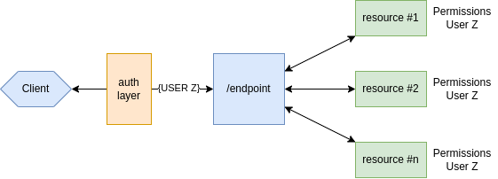
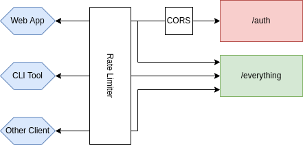
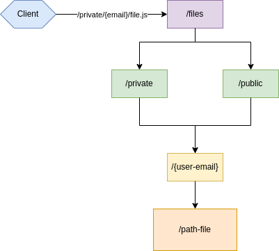
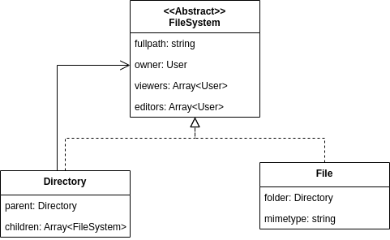
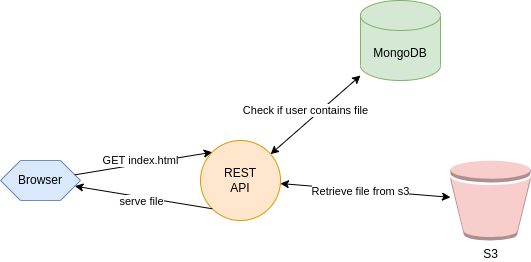

# Table of Contents

- [Introduction](#introduction)
- [Architecture](#architecture)
- [Authentication](#authentication)
- [Authorization](#authorization)
- [API Security](#api-security)
- [Files & Sharing](#files--sharing)
- [Personal Page](#personal-page)
- [Conclusion](#conclusion)

# Introduction

# Architecture

# Authentication

# Authorization

# API Security

# Files & Sharing

# Personal Page

# Conclusion
